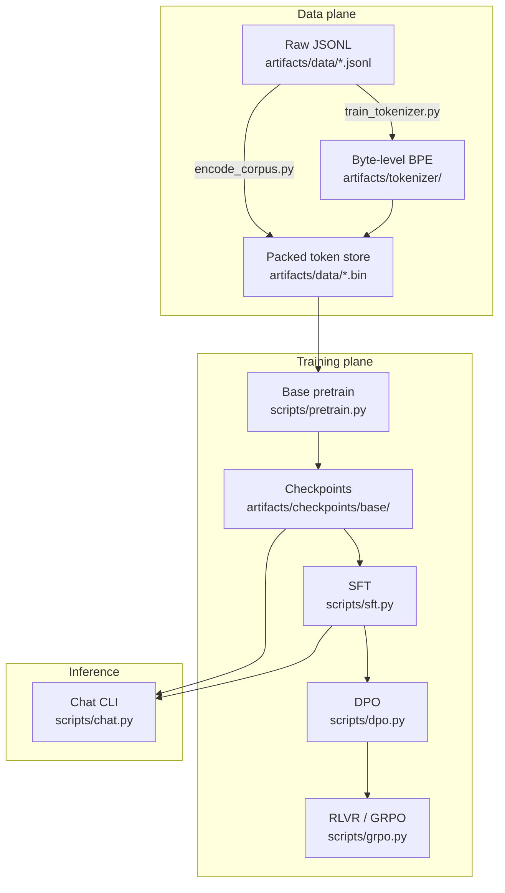
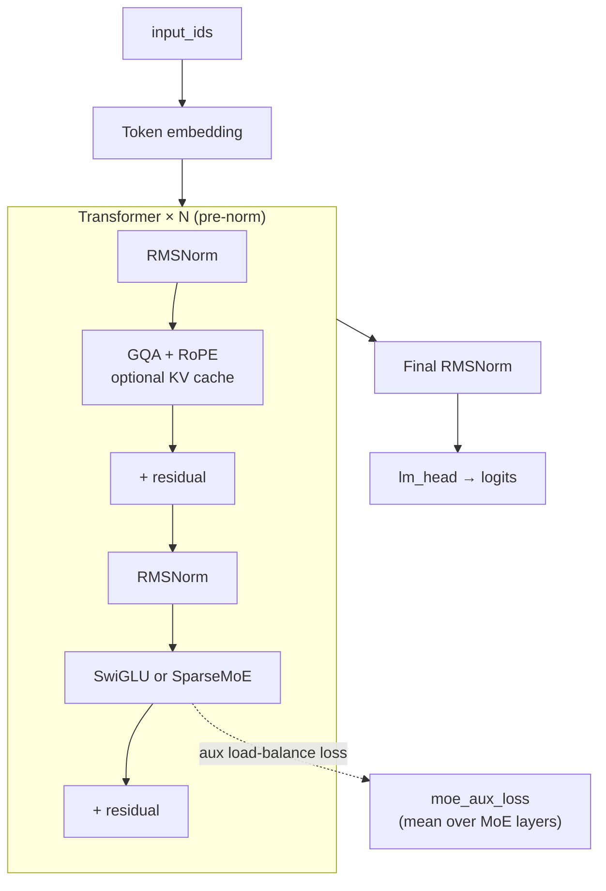
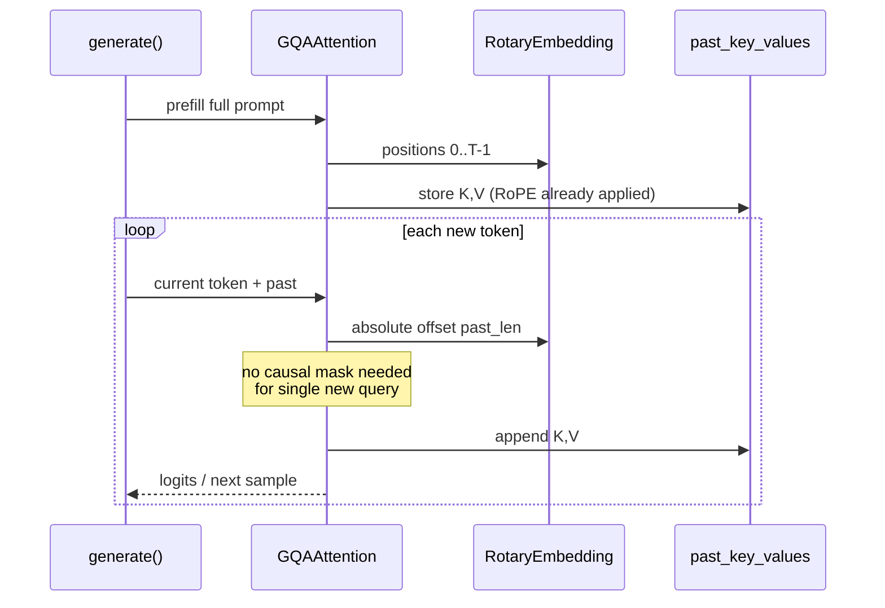
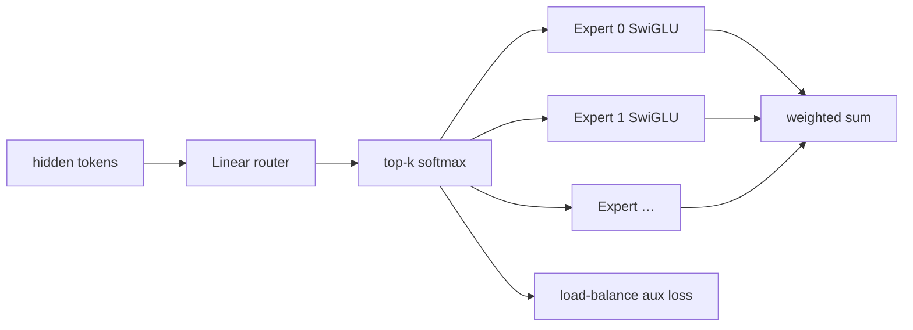

# Architecture

Tiny-GPT is a decoder-only Transformer reference implementation with modern components (GQA, RoPE, SwiGLU, optional sparse MoE) and a full training loop path.

## System overview

## Model stack (`TinyGPT`)

## Attention & KV cache

## MoE routing (reference)

> MoE loops over experts for clarity. Faster stacks use token-dispatch kernels.

## Package modules

| Module | Role |
|--------|------|
| `tiny_gpt.model` | `TinyGPT`, attention, RoPE, MoE, generate |
| `tiny_gpt.config` | `ModelConfig` / `TrainConfig` / YAML load |
| `tiny_gpt.tokenizer` | BPE train / load |
| `tiny_gpt.data` | JSONL text extract, packed `TokenDataset` |
| `tiny_gpt.training` | DDP setup, LR schedule |
| `tiny_gpt.checkpoint` | save / load |
| `tiny_gpt.posttrain` | SFT masks, DPO, RLVR trainer |
| `tiny_gpt.evals` | loss / perplexity helpers |

## Configs

| File | Intent |
|------|--------|
| `configs/smoke.yaml` | Tiny model (d=64, 2 layers) — pipeline smoke test |
| `configs/small.yaml` | ~350–400M-param single-GPU reference |

See also [artifacts.md](artifacts.md) and [pipeline.md](pipeline.md).
