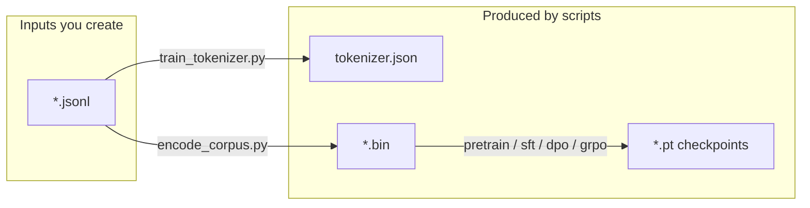

# Artifacts

All runtime inputs/outputs live under **`artifacts/`**. You create the JSONL corpora (see [data.md](data.md)); scripts produce tokenizer files, token bins, and checkpoints. Empty dirs may keep a `.gitkeep`.

## Layout

```text
artifacts/
├── data/
│   ├── train.jsonl          # you provide  {"text": "..."}
│   ├── val.jsonl            # you provide
│   ├── sft.jsonl            # you provide (later)
│   ├── dpo.jsonl            # you provide (later)
│   ├── rlvr.jsonl           # you provide (later)
│   ├── train.bin            # encode_corpus.py
│   └── val.bin              # encode_corpus.py
├── tokenizer/
│   ├── tokenizer.json       # train_tokenizer.py
│   └── special_tokens.txt
└── checkpoints/
    ├── smoke/               # configs/smoke.yaml
    ├── base/                # configs/small.yaml
    ├── sft/
    ├── dpo/
    └── rlvr/
```



## Artifact catalog

| Artifact | Path | Producer | Consumer |
|----------|------|----------|----------|
| Pretrain JSONL | `artifacts/data/train.jsonl` | You | `train_tokenizer.py`, `encode_corpus.py` |
| Val JSONL | `artifacts/data/val.jsonl` | You | `encode_corpus.py` |
| Tokenizer | `artifacts/tokenizer/tokenizer.json` | `train_tokenizer.py` | encode, train, chat |
| Train token bin | `artifacts/data/train.bin` | `encode_corpus.py` | `pretrain.py` |
| Val token bin | `artifacts/data/val.bin` | `encode_corpus.py` | `pretrain.py` |
| Checkpoints | `artifacts/checkpoints/**/*.pt` | training scripts | resume / chat / post-train |

## Config → paths

| Config | `token_bin` / `val_token_bin` | `checkpoint_dir` |
|--------|-------------------------------|------------------|
| `configs/smoke.yaml` | `artifacts/data/*.bin` | `artifacts/checkpoints/smoke` |
| `configs/small.yaml` | `artifacts/data/*.bin` | `artifacts/checkpoints/base` |

## JSONL schemas

**Pretrain**

```json
{"text":"The capital of India is New Delhi."}
```

**SFT** (later)

```json
{"messages":[{"role":"user","content":"..."},{"role":"assistant","content":"..."}]}
```

## Git policy

Ignored: checkpoint weights, tokenizer outputs, `*.bin`. Commit small JSONL samples only if you want a reproducible demo corpus — not fabricated eval sets.
