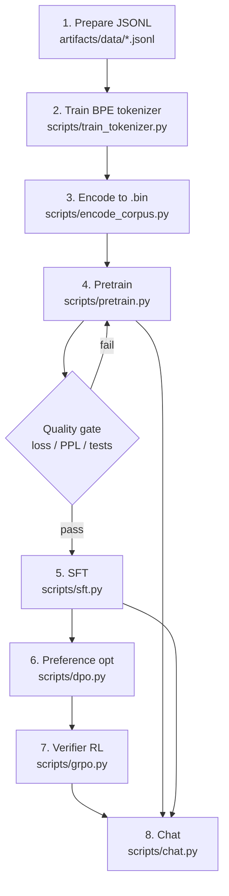
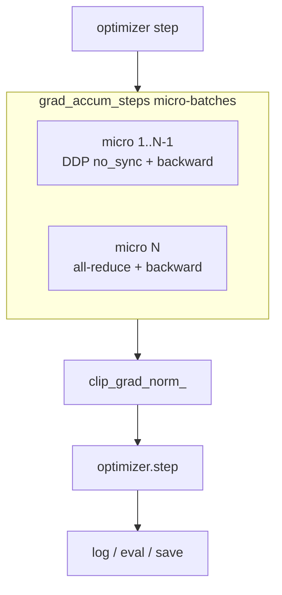
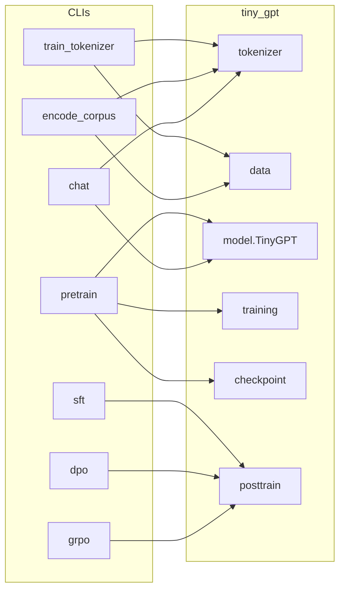

# Pipeline

End-to-end path from raw text to a chatty checkpoint.

## Flow



## Commands (copy-paste)

### 1–3. Data & tokenizer

```bash
# Optional: tiny public-domain JSONL for plumbing only
uv run python scripts/get_smoke_data.py

# Expects {"text": "..."} lines you placed under artifacts/data/
uv run python scripts/train_tokenizer.py \
  --input artifacts/data/train.jsonl \
  --output-dir artifacts/tokenizer \
  --vocab-size 32000

uv run python scripts/encode_corpus.py \
  --input artifacts/data/train.jsonl \
  --tokenizer artifacts/tokenizer/tokenizer.json \
  --output artifacts/data/train.bin

uv run python scripts/encode_corpus.py \
  --input artifacts/data/val.jsonl \
  --tokenizer artifacts/tokenizer/tokenizer.json \
  --output artifacts/data/val.bin
```

### 4. Pretrain

```bash
# Plumbing proof (tiny). --tokenizer only required if you opt into
# mask_document_boundaries: true in the config.
uv run python scripts/pretrain.py --config configs/smoke.yaml

# Single-GPU reference
uv run python scripts/pretrain.py --config configs/small.yaml

# With document-boundary masking (opt-in)
uv run python scripts/pretrain.py --config configs/smoke.yaml \
  --tokenizer artifacts/tokenizer/tokenizer.json

# Multi-GPU (DDP)
torchrun --nproc_per_node=8 scripts/pretrain.py --config configs/small.yaml

# Resume after preemption
uv run python scripts/pretrain.py --config configs/small.yaml \
  --resume artifacts/checkpoints/base/step_500.pt
```

### 5–7. Post-training

```bash
uv run python scripts/sft.py --config configs/small.yaml \
  --tokenizer artifacts/tokenizer/tokenizer.json \
  --checkpoint artifacts/checkpoints/base/step_500.pt

uv run python scripts/dpo.py --config configs/small.yaml \
  --tokenizer artifacts/tokenizer/tokenizer.json \
  --checkpoint artifacts/checkpoints/sft/final.pt

uv run python scripts/grpo.py --config configs/small.yaml \
  --tokenizer artifacts/tokenizer/tokenizer.json \
  --checkpoint artifacts/checkpoints/dpo/final.pt
```

Exact CLI flags may vary slightly per script; inspect `scripts/*.py --help`.

### 8. Chat

```bash
uv run python scripts/chat.py \
  --config configs/small.yaml \
  --tokenizer artifacts/tokenizer/tokenizer.json \
  --checkpoint artifacts/checkpoints/base/step_500.pt
```

Generation stops on `<|eot|>` when that special token is present in the tokenizer.

## Training loop internals (pretrain)



## Script → module map


